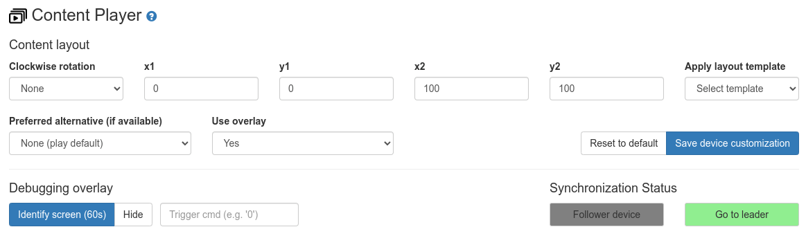

[](https://info-beamer.com/use?url=https://github.com/info-beamer/package-player-ng)

A media player that supports FullHD videos and images. Each playlist slot can be
individually scheduled. Synchronized playback is available when installing a single setup
on multiple devices. Within such a screen group, individual devices can optionally play
alternative content. Finally each screen layout can be individually customized to rotate
or place content, allowing features like 2x2 video wall playback of content.

# Alpha release

This is a first release of this package. The package includes a number of new features
not previously available on info-beamer hosted. As such it's still considered experimental.
You're welcome to use this package but should be aware that things might not always 100% work.
Feedback is very welcome.

# Usage guide

## Creating a playlist

You create a playlist similar to other package (like the HD player for example). When you
open the setup's configuration page, click on the "Add playlist slot" button to add one or
more images or videos to your playlist:


Then select the images/videos from the popup. Your newly added content will be appended to
the playlist:


Each playlist slot can have additional alternative content. You can specify
which alternative slot each device should preferrably play on its device detail page.
There are a total of 8 alternative slots available. If you add multiple assets to the
same alternative slot the device will loop between all alternatives for that slot.
Additionally if you have the same number of assets in multiple alternative slots, they
will always play in sync. So if you have item1, item2 and item3 as "Alternative 1" and
item4, item5 and item6 as "Alternative 2", item1 and item4 will always play together.

Multiple devices in a local network all running the same setup will automatically
form a peer group and synchronize playback of content by selecting one leader device that
controls the group. Make sure you have the P2P (peer-to-peer) feature enabled for
all devices and configured your network to allow cross device communication.

## Scheduling

You can change the individual play duration for each item. By default it's 10 seconds for
images and the video's duration for any video content. Also by default each added item
is always scheduled. The greenish "Always" indicates that. You can click it to switch
between "Always" and "Never".

If you want to schedule an item according to a custom schedule, click the small calendar
icon within the schedule configuration button. It will open up a schedule editor. You
can specify the type of schedule (month, week or day) and set a start and optional end
date. Additionally you can specify if and how the schedule should be repeated. Within
the editing area you can then click and hold to set multiple active range within the
day, week or month.


You can control the device's timezone on the device list page. Select a device, then
select "Modify device.." and select "Set timezone..".

### Copying schedules

You can use the two clipboard buttons next to customized schedules to copy and paste
each schedule. If want multiple playlist slots have the same schedule, copy the schedule,
then paste on each slot. Alternatively after you've pasted to one slot you can hold
'SHIFT' and paste on another slot. The editor will copy the schedule to all items between
the two slots.

### Editing an existing schedule

Use the "Edit.." button to edit a schedule for a playlist item. Note that this will only
change the schedule of that individual item. Copied schedules are not affected, so you'll
have to copy any change to other playlist slots again if needed.

You can remove a custom schedule by clicking on the "X" symbol. This will remove the
custom schedule and revert the playlist slot to "Always".

### Getting an overview

You can click on the "Show scheduling details" in the top right corner of the playlist.
This will open up additional information regarding scheduling of your playlist.


At the top you can switch between a daily and weekly preview as well as change the
preview day/week.

Below you seen an overview of when each playlist item get scheduled. In the example
above, one slot is scheduled between 6am and 7pm (as set in the schedule editor above), while
the other is always scheduled.

The same information is also added above each individual playlist slot. You can see when
the slot is schedule on the selected day.

## Playback settings

Below the playlist is a section for playback settings for this setup:


### Fallbacks (blank)

If no playlist slot is scheduled, the player will revert to playing a fallback image. You
can specify one for both the horizontal/landscape as well as the vertical/portrait orientation.

Optionally you can also decide that devices should switch off their attached display if only
fallback content is active. Once any playlist slot is scheduled again, will the display
turn on again. Warning: Do not use this mode together with other packages that modify the power
state of the attached display (like the Power Saver package) as both packages will then fight
over the state of the TV.

### Content scaling (scaling)

You can decide what happens when the content aspect ratio doesn't match the display aspect ratio.
Honoring the aspect ratio will result in black bars on the top/buttom or sides, while
'Fill available space' will stretch the content to the display size, regardless of how that
might look. Additionally you have the option to allow minor adjustments, in case the difference
between the display and content aspect ratio is small enough. This will allow slight stretching
of your content to better fit on the display.

### Audio

This allows you to play audio for any video containing an audio track.

### Proof-of-play (pop)

This feature is currently being developed. It allows you to submit and keep a central log of
all assets shown on a screen. Stay tuned.

### Remote control (remote_port)

This is an advanced feature that allows you to interrupt the normal playback and to manually
enqueue items. This will optionally open up a UDP port on the device. You can send a custom
packet to a device to enqueue content to interrupt the normal playback:

```
trigger:<idem>:<trigger list>
```

`idem` should be a random value can will be used to deduplicate multiple UDP packets arriving
with the same value. `trigger list` is a comma separated list containing one of three different
values each:

 * A numeric value. This is a playlist slot, counting from 0. For example to trigger the first
   item in your playlist, send a `0`.
 * A string value starting with `a:`. Append the asset id of an asset added within the playlist
   to trigger this asset. For example `a:1234` will trigger playback to the asset with id 1234,
   assuming that asset has been added as a playlist slot.
 * A string value starting with `f:`. Append the filename of the asset to trigger, similar to
   the id above.

Triggered items need to be added to the playlist, but can be schedules as 'Never' so they do
not normally get scheduled.

# Device specific configuration (devicecontrol)

Some playback settings are not part of the device but part of the device's configuration. Once
you assign a setup to a device, go to the device's detail page and scroll down to the "Player"
section:



Setting you make will be saved and synced to the device when clicking "Save device customization".

## Content layout

You can specify if and how the content should be rotated as well as placed on the available
display area. The "Clockwise rotation" allows you to rotate the content.

The four values `x1`, `y1`, `x2` and `y2` allow you to specify the screen area used to
display your content. The values are specified on "percent of available screen space". The
default for `0` for `x1` and `y1` means the top left corner, while  `100` for `x2` and `y2`
is the bottom right corner of the display. You can specify your own values or use the
template dropdown to select and apply among a selection of presets.

Note that the values do not necessarily have to be between `0` and `100`. If you use values
outside of that range, you can, among other things, configure multiple devices to act as a
single screen area for a video wall type setup.

## Alternative content

As already discussed in the playlist configuration above, each playlist slot can specify
alternative content. You can use the "Preferred alternative" dropdown to select which
of those alternative content the device should play.

## Debugging

You can identify a device and show various debugging values by clicking on the "Identify screen"
button. This will show an overlay above the normal content on the device for the next 60 seconds.

## Synchronization Status

Multiple devices in the same network running the same setup will automatically form a group
of devices. The status shows the device role (leader or follower). Use the "Go to leader" on
a follower device to go to the device detail page of the leader device.

# Howto

## Synchronized playback

Here's how you create a setup that shows different but synchronized content on a group of
devices:

 * Create the playlist for a single device using the "Add playlist slot.." button.
 * Click on "Add alternative asset" on each playlist slot, add the alternative asset for
   a second display and select "Alternative 1".
 * Repeat for each additional display: Add another asset, and select "Alternative 2", etc..
 * On each device that should play alternative content, go to the device page after assiging
   the setup and select the alternative in the dropdown. Then click on "Save device customization".

## Video wall

This package can be used to show video wall content across a number of devices. As an example,
a 2x2 video wall can be set up as follows:

 * Create the playlist using the setup configuration editor and assign the setup to the four
   devices.
 * Go to each device's individual device details page and use the "Apply layout template"
   dropdown. Select the correct 2x2 option for each of the four devices, then click on
   "Save device customization".

# Changelog

## Version alpha-5

 * Updated to work together with packages like power saver, if the
   "Show fallback content" option is selected. When "Turn off display"
   is selected, the package expects it to be in control of the display
   though, so you should not mix it with the power saver in that case.

## Version alpha-4

 * Fixed device status on device detail page not getting updated after
   one day of device uptime.

## Version alpha-3

 * Added features to default overlay: It adds some features from the
   old HD player like Ken burns effect as well as progress indicators.
 * Overlay can now loop through l-wraps, bottom/side images or logos
   placed on top of the main content.

## Version alpha-2

 * Added optional playlist slot fusing: If you assign the same asset to two
   or more consecutive playlist slots, the playback for a video won't restart
   but instead continues across slots.
 * Added initial support for content child nodes.
 * Added initial support for overlay child nodes.

## Version alpha-1

 * Initial public release
